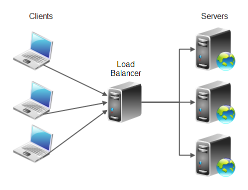

# Load Balancer

Ever wonder how Facebook, Linkedin, Twitter, and other web giants handle such huge amounts of traffic? They don’t have just one server, but tens of thousands of them. In order to achieve this, web traffic needs to be distributed to these servers, and that is the role of a load balancer.

## Readme:

- [Load Balancing](https://www.thegeekstuff.com/2016/01/load-balancer-intro/)
- [Load Balancing Algorithms](https://community.f5.com:443/t5/technical-articles/intro-to-load-balancing-for-developers-the-algorithms/ta-p/273759)

